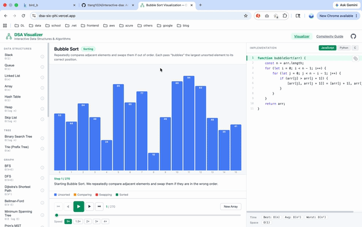

# ⚡ DSA Visualizer

An interactive web app for learning **Data Structures & Algorithms** through step-by-step animations. Pick an algorithm, press play, and watch it run while the corresponding source code highlights line-by-line in C, Python, and JavaScript.

Visit: https://dsa-six-phi.vercel.app

## Demos

**Bubble Sort** — Repeatedly compares adjacent elements and swaps them if out of order. Each pass "bubbles" the largest unsorted element to its correct position.



## Features

- **37 visualizations** across 6 categories (Data Structures, Tree, Graph, Sorting, Searching, Algorithms)
- **Step-by-step playback** with play/pause, step forward/back, jump to first/last, an adjustable speed control, and a draggable timeline scrubber
- **Keyboard shortcuts** — `Space` to play/pause, `←`/`→` to step, `Home`/`End` to jump to the first/last frame
- **Synchronized code panel** showing C / Python / JavaScript with the active line highlighted on each step
- **Three-panel layout**: algorithm list (left), animated visualizer + controls (center), multi-language code (right)
- **Complexity guide** — a sortable reference of time/space complexity for every algorithm
- **Per-algorithm details pages** with deeper explanations
- **Regenerable inputs** — a context-aware button feeds each algorithm fresh data (e.g. _New Array_ for sorts, _New Target_ for Greedy, _New N_ for Recursion); fixed-scenario algorithms hide it
- **Accessible** — respects `prefers-reduced-motion`, focus-visible outlines, and ARIA labels on controls

### Included algorithms

| Category        | Algorithms                                                                                              |
| --------------- | ------------------------------------------------------------------------------------------------------- |
| Data Structures | Array, Linked List, Stack, Queue, Hash Table, Heap, Skip List                                           |
| Tree            | Binary Search Tree, Trie                                                                                |
| Graph           | BFS, DFS, Graph (adjacency list), Dijkstra, Bellman-Ford, MST (Kruskal), Prim's MST                     |
| Sorting         | Bubble, Selection, Insertion, Merge, Quick, Heap, Shell, Counting, Radix, Bucket                        |
| Searching       | Linear, Binary, Jump, Interpolation                                                                     |
| Algorithms      | Recursion, Hash Algorithm, Greedy, Divide & Conquer, Backtracking, Dynamic Programming, String Matching |

## Getting started

```bash
# Install dependencies
npm install

# Start the dev server (http://localhost:5173)
npm run dev

# Build for production
npm run build

# Preview the production build
npm run preview
```

## How it works

Each algorithm exposes a `generateSteps()` function that returns an array of frames.

- `VisualizerPage` precomputes the step list once per algorithm, then a `setTimeout` loop advances the current step at the chosen speed.
- Each visualizer is a pure renderer that maps the current step's state (e.g. `array` + `highlights`) to the DOM. Smooth motion comes from CSS `transition` rules — there are no `@keyframes`; the browser interpolates between discrete React renders.
- `codeLines` maps `{ c, python, javascript }` to 1-indexed line numbers so the code panel can highlight the relevant line for the current step.
- Visualizers are loaded with `React.lazy` + `Suspense`, and routes are code-split, so the browser only downloads the visualizer it needs.

## Routes

| Path           | Page            | Description                           |
| -------------- | --------------- | ------------------------------------- |
| `/`            | VisualizerPage  | Main three-panel visualizer           |
| `/complexity`  | ComplexityGuide | Time/space complexity reference table |
| `/details/:id` | DetailsPage     | In-depth page for a single algorithm  |

### Adding a new algorithm

1. Add a step generator in `src/algorithms/<name>.js`.
2. Add a visualizer in `src/components/<Name>Visualizer.jsx` (or reuse an existing `type`).
3. Register a new entry in `src/data/algorithms.js` (with `type`, metadata, and multi-language `code`; optionally add `regenerate: { label, makeInput }` to show an input button).
4. Add a `case` to the `Visualizer` switch in `VisualizerPage`.
5. Add any type-specific styles to `App.css` and a Legend override if needed.

## License

Released under the [MIT License](LICENSE) — free to use, modify, and distribute with attribution.
</content>
</invoke>
